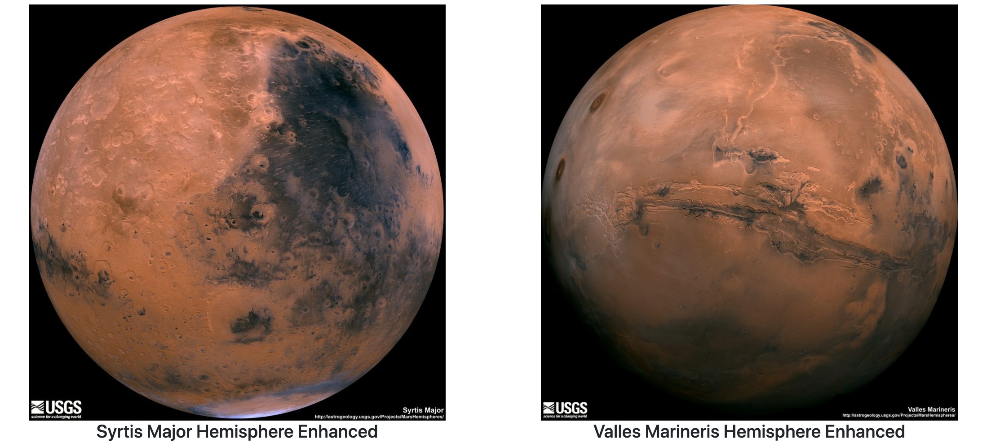

# Web-scraping-challenge

## Table of Contents
* [Description](#description)
* [Preview](#preview)

## Description
In this assignment, I will build a web application that scrapes various websites for data related to the Mission to Mars and displays the information in a single HTML page. The following outlines what you need to do.

## Preview
Here is the final product of the app.

## More Info
Github: https://github.com/aspivak5

Email: aaron.spivak5@gmail.com